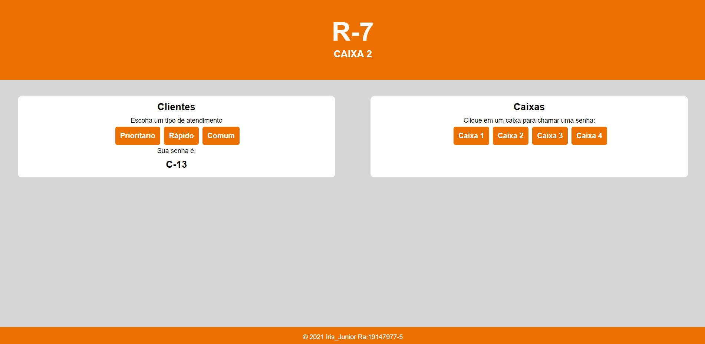
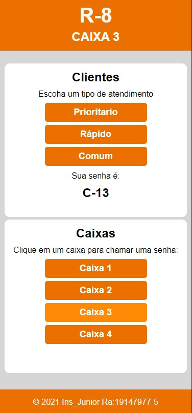
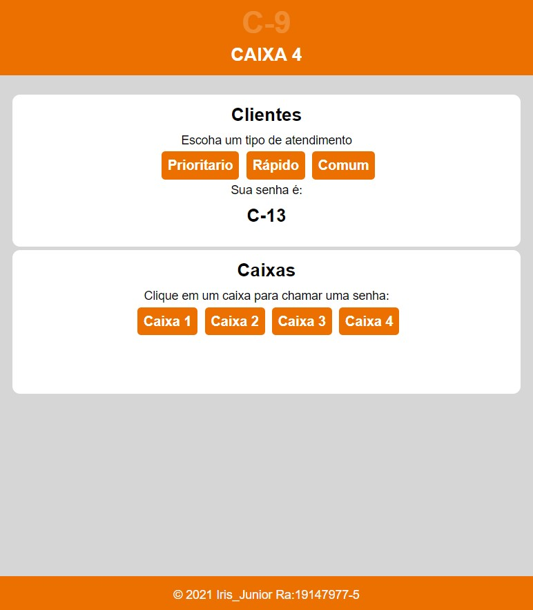

# Sistema de gerenciamento de senhas 
Sistema desenvolvido para o gerenciamento de senhas por tipo de atendimento, são três tipos de atendiomento "Prioridade", "Rapido" e "Comum" e todos os caixas tem uma logica para a chamada das respectivas senhas.

## Logicas dos caixas
- __Caixa 1__:Realiza os atendimentos preferenciais. Se não houver atendimentos preferenciais na fila, atende o próximo atendimento rápido. Se não houver também, atende o próximo comum. Se não houver nenhum, não faz nada
- __Caixa 2 e 3__:Atendem primeiro as senhas de atendimento rápido, se não houver atende o próximo da atendimento prioritário. Se não houver também, atende o próximo comum. Se não houver nenhum, não faz nada.
- __Caixa 4__: Realiza os atendimentos comuns. Se não houver atendimentos comuns na fila, atende o próximo atendimento prioritário. Se não houver também, atende o próximo rápido. Se não houver nenhum, não faz nada.


## 📦 Tecnologias utilizadas para construção:

- HTML5 -  Como linguagem de marcação.
- CSS3  -  Para estilização de todos os componentes.  
- Javascript - para as funcionalidades de filas,caixas,painel de chamada e indicação da senha gerada.
- Design Responsivo - Media Queries e Medidas Relativas.

## 🖥 Preview do projeto 





## 📋 Pré-requisitos

Antes de qualquer coisa, você precisa ter instaldo o [Google Chrome](https://www.google.com/intl/pt-BR/chrome) e [Git](https://git-scm.com/downloads). 

## 🔧 Como rodar a página

Abra o terminal Git Bash no diretorio em que deseja salvar o projeto e cole o seguinte comando:
 
```
https://github.com/Irisjunior/Cesubank.git
```
